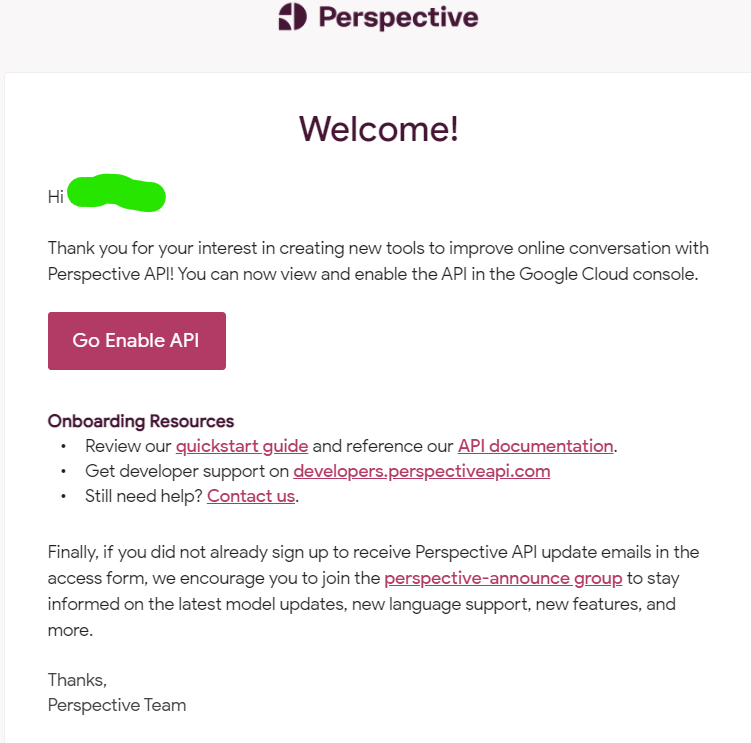

# 🔍 Google Custom Search Api Key 
*Used for `google` command*

1) Visit [google custom search page](https://developers.google.com/custom-search/v1/introduction#identify_your_application_to_google_with_api_key)
2) Press 'Get a Key'
3) Create a new project and enter project name
4) Copy api key to config file
5) You're all ready to go!

# 👀 Perspective API Key

1) Visit [google cloud](https://console.cloud.google.com/)
2) Create a new project
3) Name the project
4) Fill out [this form](https://docs.google.com/forms/d/e/1FAIpQLSdhBBnVVVbXSElby-jhNnEj-Zwpt5toQSCFsJerGfpXW66CuQ/viewform)
5) Within an hour you should receive an email (the account you used to sign into google cloud) confirming that you can enable the API:

6) Click on the [Go Enable API](https://console.cloud.google.com/apis/library/commentanalyzer.googleapis.com) button 
7) Enable the api by clicking "Enable"
8) Create API key by going to [credentials](https://console.cloud.google.com/apis/credentials) 
9) Press "Create Credentials" and select "API Key"
10) You're done!
